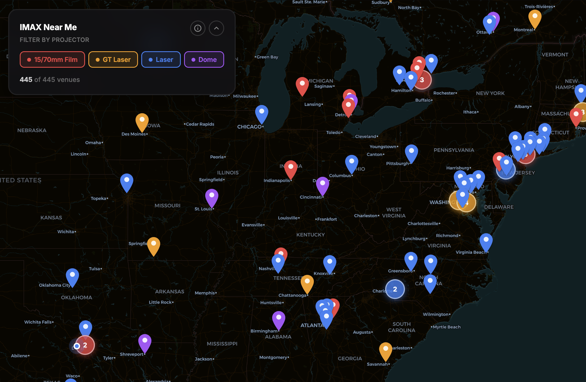

# [IMAX near me](https://imaxnearme.com)



Interactive map of premium IMAX theatres worldwide, filtered by projector type.
Venue data comes from the [IMAX Fandom Wiki](https://imax.fandom.com/wiki/List_of_IMAX_venues),
enriched with Google Places details and IMAX.com showtimes links, and is served
from Cloudflare R2. Base-level xenon screens are excluded.

## Development

Requires Node.js 24 or later and pnpm 10.26.0 (pinned in `package.json`).

```sh
pnpm install --frozen-lockfile
pnpm exec cf auth login
pnpm run dev
```

The app uses `cloudflare.config.ts`, `cf`, and the Cloudflare Vite plugin.
One Worker, `70mm`, serves the website on `imaxnearme.com` and runs the venue
refresh cron. Its `FetchVenues` export implements the durable Workflow; this
is part of the same Worker.

The shell data pipeline remains available for local use. Put
`GOOGLE_PLACES_API_KEY` in `.env`, then run `pnpm run fetch-venues`. For local
venue data, copy `imax-venues.json` into `public/`.

An API token in `.env` takes precedence over the saved cf login. To use the
saved login when an older repository token has insufficient permissions, run
commands with `CLOUDFLARE_API_TOKEN=`.

## Commands

| Command | Purpose |
| --- | --- |
| `pnpm run dev` | Develop the website with cf/Vite |
| `pnpm run build` | Type-check and build Cloudflare Build Output |
| `pnpm run deploy` | Build and deploy the combined Worker with cf |
| `pnpm run deploy:production` | Deploy prebuilt output, installing the supplied secret |
| `pnpm run deploy:preview` | Deploy a branch preview and report its URLs to Builds |
| `pnpm test` | Test parsing, enrichment, upload guards, and preview reporting |
| `pnpm run check:fetch-venues` | Generate bindings types and check the Worker |
| `pnpm run refresh-venues` | Start a manual Cloudflare venue refresh |
| `pnpm run fetch-venues` | Run the original local shell pipeline |
| `pnpm run download-cache` | Download the Google Places cache through cf |
| `pnpm run download-imax-cache` | Download the IMAX URL cache through cf |
| `pnpm run upload-venues` | Upload venue data after the size-drop check |
| `pnpm run upload-cache` | Upload the Google Places cache after the size-drop check |
| `pnpm run upload-imax-cache` | Upload the IMAX URL cache after the size-drop check |

## Workers Builds and PR previews

The existing `70mm` Worker connects to `mvvmm/imax-near-me` through Workers Builds,
using Node 24. **Merging to `main` deploys production**; local checks do not deploy.
Do not run a deployment manually without the repository owner's approval.

| Build | Root | Build command | Deploy command |
| --- | --- | --- | --- |
| Production (`main`) | `/` | `pnpm test && pnpm run build` | `pnpm run deploy:production` |
| Previews (feature branches/PRs) | `/` | `pnpm test` | `pnpm run deploy:preview` |

PR previews serve the public R2 dataset. Their configuration omits the production
route and cron, and supplies an empty Google Places key. The actual key is a
**production-only Builds secret**. The production deploy wrapper passes it to cf
through a temporary file with private permissions, then deletes the file.

`cf previews deploy` currently omits the output file Workers Builds needs for
PR comments ([cf issue #185](https://github.com/cloudflare/cf/issues/185)).
`scripts/deploy-preview.mjs` runs cf and writes its result with `worker_name` and
`timestamp` into `WRANGLER_OUTPUT_FILE_DIRECTORY`. The environment variable and
file prefix are Cloudflare's existing reporting protocol; no Wrangler package
or executable is used. Remove this wrapper after the upstream fix is verified.

## Scheduled venue refresh

`worker/` contains the refresh code deployed alongside the website in `70mm`.
Its cron runs at **06:00 UTC on the 1st and 15th of each month**
(`0 6 1,15 * *`) and starts a durable Workflow. Scheduling is independent of
GitHub repository activity; the old GitHub scheduled workflow has been retired.

The refresh reads `theatre-details.json` and `imax-urls.json` from the existing
`imaxnearme-data` bucket and looks up only uncached venues. Durable batches retry
upstream failures. HTTP failures and search challenges never become permanent
cached misses. All three JSON files must pass the existing 10% size-drop guard;
venue and coordinate counts must also stay within 10% of the previous dataset.
The public dataset is published last. Errors remain visible in Cloudflare
Workflow status and Worker logs while the previous dataset stays available.

The Worker requires the Cloudflare secret `GOOGLE_PLACES_API_KEY`. Workers Builds
supplies it on merge through `pnpm run deploy:production`. Approved local deploys
can read it from the ignored `.env`; subsequent cf deploys retain installed
secrets. The running job uses a direct R2 binding and needs no Cloudflare API token.

Inspect runs in the Cloudflare Workflows dashboard or with:

```sh
pnpm exec cf workflows instances get INSTANCE_ID --workflow-name imaxnearme-venues
```

### Consolidation cutover

The earlier `imaxnearme-fetch-venues` Worker remains live until this PR is merged
and `70mm` has successfully refreshed the data. Its Builds integration has been
disconnected, so merging cannot deploy the removed nested project. After the merge:

1. Run `pnpm run refresh-venues` and verify the returned instance reaches `complete`
   in the `imaxnearme-venues` Workflow.
2. Check the refreshed R2 dataset and the website.
3. Remove the legacy resources (these commands have not been run):

```sh
pnpm exec cf workflows delete imaxnearme-fetch-venues
pnpm exec cf workers delete imaxnearme-fetch-venues
```

Do not remove the `imaxnearme-data` bucket. Once cutover is verified and cleanup
is complete, `70mm` is the only production Worker.

## Stack

React, MapLibre, TypeScript, Vite, Cloudflare Workers/R2/Workflows, cf CLI.
